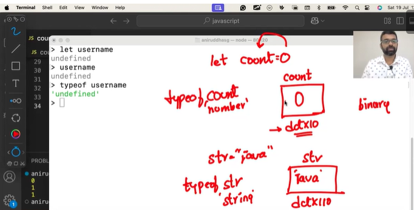

Other options to run JavaScript code is repl

## repl - read evaluate print loop
To enter a **repl** you type **node** in the terminal/powershell then you don't need to create a file . from here whatever you will write in the terminal will be treated as a JavaScript code.
- To get exit from **repl** we have to type **.exit**
- It is the place to test the code(usually 1 to 2 lines of code), not to write the entire code because once you closed it then everything will be lost.
       
       let price == 50000;
       here, the value 50000 is assigned to variable price.

#### JavaScript is a loosely/dynamic typed language.
whenever we are creating a variable, then we don't have to specify what type(datatype) of value will be stored inside it.

         here you have to write,
         String name = "mackbook" ❌
         just write,
         let name = "mackbook" ✅

         we can also write like this:
         a = "sanu";
         a = 10;
         a = true;

Q). What is opposites of loosely typed language? <br>
ans: It is strictly typed language. <br> e.g: Java


#### There are 3 ways to create a variables ?
1. var
2. let &
3. const

- While creating varibles, we have to decide whether I have to use var, let or const to create a variables
- Before 2015 (ES5), we mostly use var , <br> but after 2015(ES6) we have 2 ways of creating a variables.<br> Either use a **let** keywords or **const** keywords.
- If you wants to change the variables then use **let** , & if you don't wants to change variables then use **const**.
- **var** keywords is used in legacy.
- Legacy, means old. i.e If any project is created before 2015, they will be using **var**. but all modern projects will be used **let & const**.

## Note: 
- With **var**, when we declare a varible there was no ways of protecting the variable. 
- We could not safeguard the variable. 
- Anybody could have come and just updated the variable. thats let's a lot of bugs.


      1. If the value of the variables changes make it as a **let**  and when a value of variables will not change then make it as a **const**.
      2. If somebody tries to change the const, then it will throw an error.

- A **String** in JavaScript can be represented using **double coute as well as single coutes**
        
        const name = "Ramji";
        const name = 'Ramji';

1. ES5 -> var
2. ES6 -> let and const

```
Examples of using const:

//declaring and assigned
const pname = "macbook";
console.log(pname);

//reassign
pname = "macbook pro"

o/p: TypeError: Assignment to constant variable.
```

- In let and const we can safegaurd the variable. USing const we cannot reassign the varibles but with **let** we can reassign the variables.
- In old days, there was one ways of creating variable and that was keywords **var**. 
  
            here anybody can come and change the value.
            //declaring and assigned
            const pname = "macbook";
            console.log(pname);

            //reassign
            pname = "macbook pro";
            console.log(pname);

            o/p: macbook pro


Q). can we write the variable without using let, var and const ? <br>
ans: Yes! but there are drawbacks for this. There is something called a global scope. and this will pollute the global scope. <br>
So, the recommandation is to use **let and const** based on the use.


Q). When we are in doubt, which one should I choose let or const ? will we change the varibles in the future. <br>
ans: Here choose **const**. so that when you think of to change the variable then we can go back and **change the keyword from const to let** in the project.


Q). When we get a **reference error** ? <br>
ans: when the variable is not found/present then we get a reference error..


Q). What are variables ? <br>
ans: Variables are basically containers for us to store data or information within our program. <br>
we can store  it, and use it on later point of time.

Q). How to convert loosely type language(JavaScript), to strictly type language ? <br>
ans: To overcome this limitations of JavaScript, we use **TypeScript** in Industry.


- **let** allow us to reassign a value to a variable, but **const** doesnot allows to reassign a value to a variables.

- In JS, index always starts with 0.

- () -> round brackets is used for invocations/call.

- To get any particular character we use either:
<br>  **charAt**  is inbuild methods of JavaScript     

              const str = "javascript";
              str[2];   //v
              or 
              str.charAt(2);  //v


- Methods is a behaviour.
  
- Variable name inside an object is called **Attribute or property**.
- Property or Attribute is nothing but called as **Informations**.
  
- 1st characters always be in ->  0th index
- Last characters always be in -> n-1 (length-1).

- If we try to access **characters** outside the index. <br> It could be of string or array. It will return **undefined**.

- In property there is no paranthesis (), but in Methods we use paranthesis ()..
  
- **typeof** is a operator &  it tells us what datatypes a variable holds/used to give the datatype of variables.
  
             e.g:
             const count = 0;
             typeof count;  // o/p: number


## Undefined

- When we are trying to access a character, outside the index, then it will return **Undefined**
- When you declare a Variable and you don't give a value to it. <br> like I create a variable and I will not assign any value to it that time, Then it will give **Undefined** 
               
               let count;
               console.log(count); //o/p: undefined


- In hight level programming language(Java, JavaScript) we don't have access to memory relocation. We do run our program on **RAM**. <br>
In low level programming language(c++), we have access to that particular memory relocation. 

<br>

