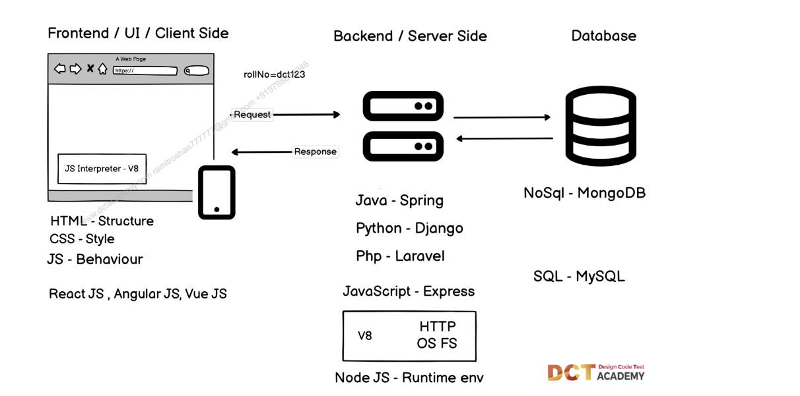

# Web Architecture 

Q). What is a Stack ?  
ans: Stack is a collection of technologies. 

- Authentication: used to identify the users. (e.g: login to gmail)
  
- Authorization: used to provide the permission to either the data or functionality within an application..  
  (e.g: through authorization, we used to add the product in flipkart).

- using XHR, we can make a request from Frontend/Client Side to Backend/ Server Side.
  
- If frontend directly interectly with database then, we are bypassing/skipping the security layer, backend is meant for security.

 

- There are 2 types of website :-  
   1. static website (read only)
   2. Dynamic website (read and write - getting interected with backend and databases)

- Java , Python, PHP there are server side programming language. (it works in a backend).

- browser only supported JavaScript, so for backend we can use java, python , php. But for frontend we must have to use JavaScript.

#### There are two types of databases :-
1. SQL databases.(data is stored in the form of tables and rows)
2. NOSQL databases.(data is represented as array of objects)

